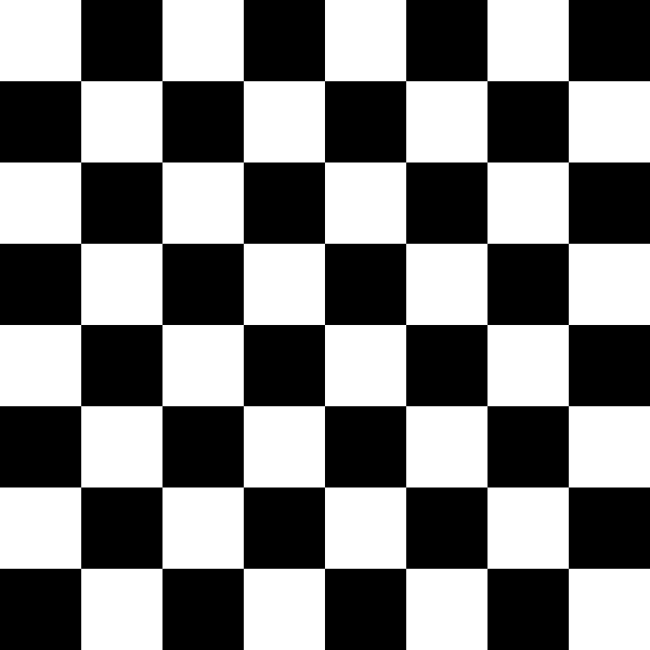
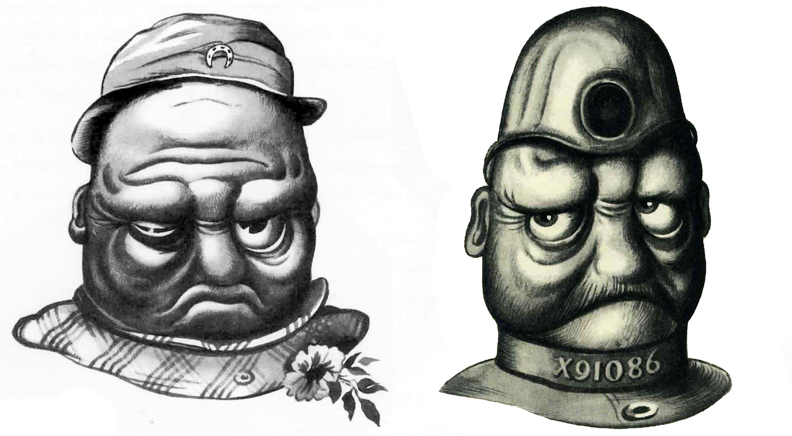

## Chess Board
- Create a chess table using **numpy** and **opencv**.
- view:
  > 
## Color Correction
- Reverse black and white colors with opencv.
- views:
  > 
  > 
## Rotatation
- Rotate an image with for loop in opencv(without cv2.rotate)
- view:
  > 
  > 
## Object Isolation
- Separate object of black-whte image using opencv and threshold method.
- view:
  > 
## Obituary image
- Create a black line in top left corner.(without opencv built-in methods)
- view:
  > 
## Gradient
- Create an image with whito-black gradient using **open-cv** and **numpy**.
- view:
  > 
## Letter 
- Design letter-M using **numpy** and **open-cv**.
- view:
  > 
